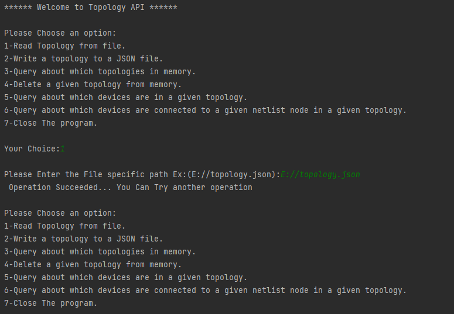
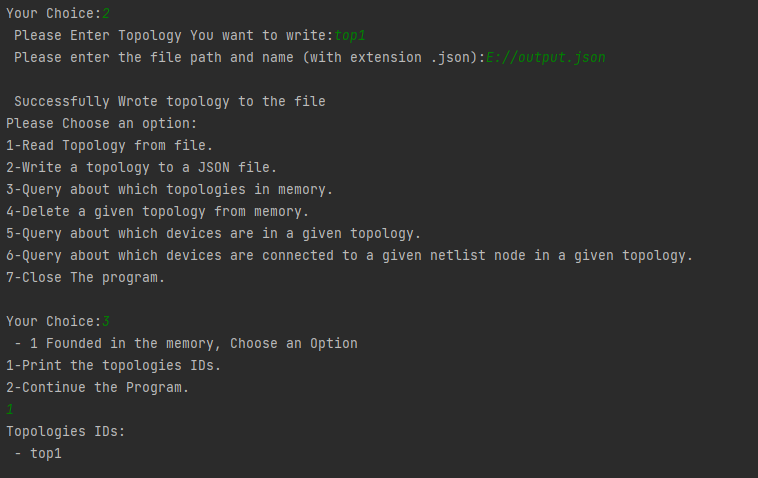
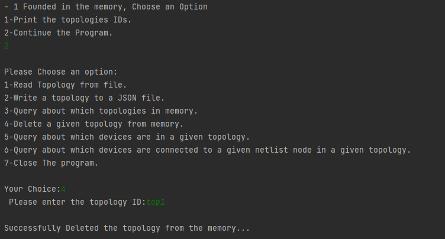
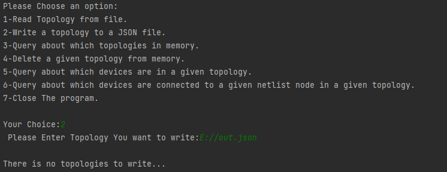
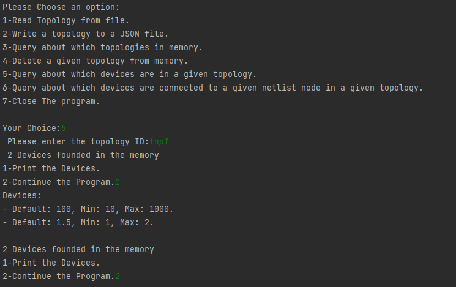
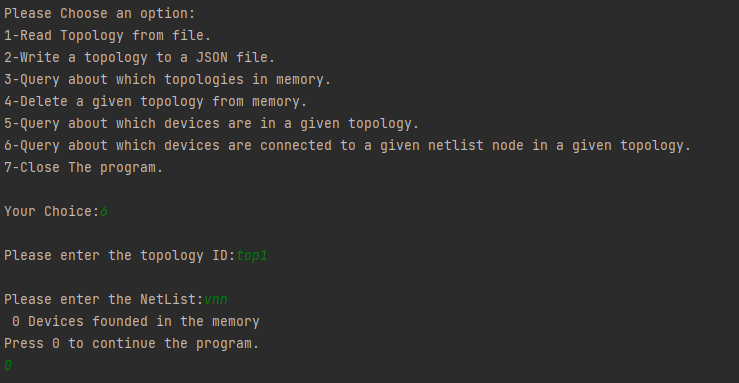
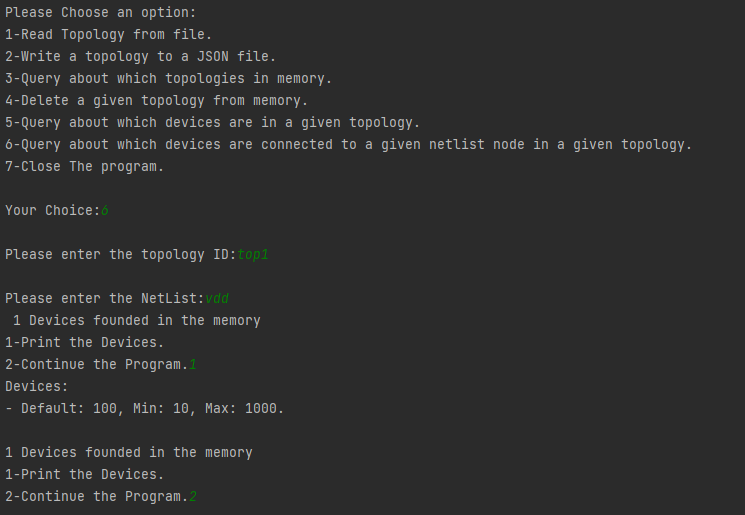
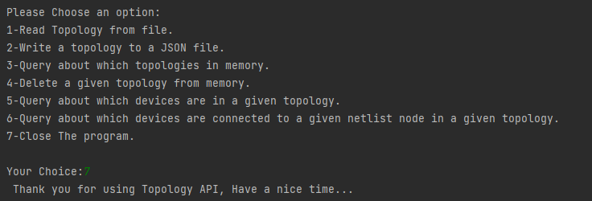

# Function Plotter

## Table of Content:

<ul>
  <li><a href="#des">Description</a></li>
  <li><a href="#ins">Installation</a></li>
  <li><a href="#run">Running</a></li>
  <li><a href="#te">Tests</a>
</ul>

<a id="des"></a>

## Description

A Command Line program that has access to many functionality:

- Read Topology from a JSON File.
- Write Topology to a JSON File.
- Delete a given Topology from the memory.
- Query to get topologies.
- Query to get all the devices from a topology with topology ID.
- Query to get all the devices from a topology with topology ID and a NetList.

<a id="ins"></a>

## Installation Steps:

```
git clone https://github.com/KamelMoohamed/Function_Plotter.git
cd Function_Plotter
gcc main.cpp -o excutablefile.exe
excutablefile.exe

```

<a id="run"></a>

## Running Steps:

> You have Access to the above operations + Close the program operation.

<a id="te"></a>

## Testing

[Note] All the tests images is related to each other

> ### Read File Test

\


<br>

> ### Write File and Query Topologies Test

\


<br>

> ### Delete File Test

\


> ### Try To Write after delete[Wrong OPtion]

\


> ### Query Devices

\


> ### Query Devices with Wrong netList [Wrong Option]

\


> ### Query Devices with Right netList

\


> ### Exit

\

